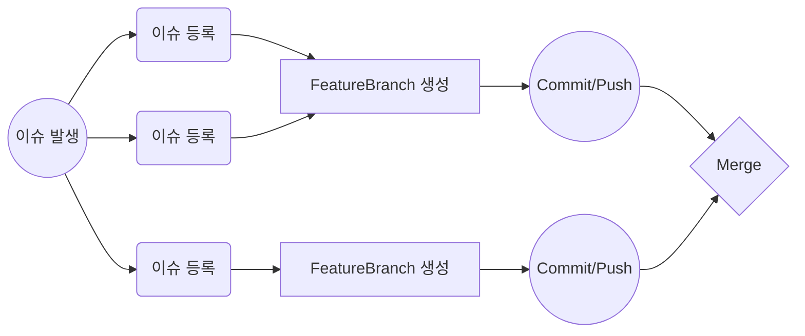

# airbnb
그룹 프로젝트 #4

- - -

# Airbnb Project

> CodeSquad Team-08
> 🗓 2022/5/23 ~ 6/10, 3 Weeks

<table>
	<tr>
		<td>포지션</td>
		<td>닉네임</td>
		<td>저장소</td>
	</tr>
	<tr>
		<td rowspan="2">**BE**</td>
		<td>Hoo</td>
		<td>https://github.com/who-hoo</td>
	</tr>
	<tr>
		<td>Ader</td>
		<td>https://github.com/ak2j38</td>
	</tr>
	<tr>
		<td rowspan="2">**iOS**</td>
		<td>Damagucci-Juice</td>
		<td>https://github.com/Damagucci-Juice</td>
	</tr>
	<tr>
		<td>Beck</td>
		<td>https://github.com/SangHwi-Back</td>
	</tr>
</table>

## Application Specs

* iOS
   - Swift
   - SnapKit
   - Alamofire
* BE
   - Java 11
   - Spring Boot
   - Mysql
   - JPA, Querydsl
   - docker, aws

## 주요 성과

|Week|---BE|---iOS|
|---|:--|:--|
|1주차|깃헙 액션을 이용한 자동 배포 플로우 구축, 요구사항 분석, 설계|설계, 홈화면 작성, LocationView 작성|
|2주차|엔티티 작성 및 연관관계 매핑, 요금검색 API 구현|Network 테스트, 커스텀 Slider/Calendar|
|3주차|숙소 검색 API를 위해 queryDSL 적용, OAuth2.0 적용|인원수 추가 화면 구성, 검색조건 테이블 뷰 추가|

## iOS Application Architecture

- MVC
- Repository -> (Dependency Injection) -> Model

## BE Application Architecture

- REST API
- Domain Layer

## 주요 WorkFlow

